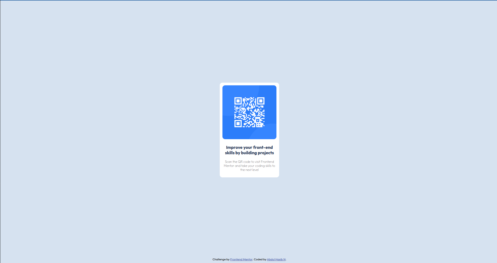

# Frontend Mentor - QR code component solution

This is a solution to the [QR code component challenge on Frontend Mentor](https://www.frontendmentor.io/challenges/qr-code-component-iux_sIO_H). Frontend Mentor challenges help you improve your coding skills by building realistic projects. 

## Table of contents

- [Overview](#overview)
  - [Screenshot](#screenshot)
  - [Links](#links)
- [My process](#my-process)
  - [Built with](#built-with)
  - [Continued development](#continued-development)
- [Author](#author)

## Overview
  This is the first project I have chosen to get started with the frontend mentor platform. Though this is easy  it is a good one to kick start the process.  
### Screenshot



### Links

- Solution URL: (https://www.frontendmentor.io/solutions/qr-code-component-baQN62cCtq)
- Live Site URL: (https://abdulhasibn.github.io/QR_code_component/)

## My process
Initially I created a github repository and started to add teh files I downloaded from the starter files folder of teh frontend mentor website.
After getting all the necessary files in place, I setup the structure of the page and added styles to teh component. To center the QR code container, I made the ```margin: auto``` fot the container class. Comparing the solutions in the website, it seems mine is a bit off teh mark compared to the required output. Need to optimize it a bit.
### Built with

- Semantic HTML5 markup
- CSS custom properties
- Flexbox

### Continued development

I would like to explore different ways to center a div in a page.

## Author

- Frontend Mentor - [@abdulhasibn](https://www.frontendmentor.io/profile/abdulhasibn)
- Twitter - [@abdulhasibn99](https://twitter.com/abdulhasibn99)
